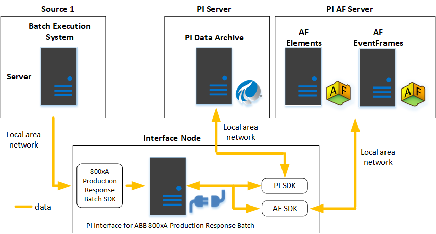

# ABB 800xA Production Response Batch configuration

The following diagram illustrates configuration of PI Interface for ABB 800xA Production Response Batch, with the data source sending event frames and assets to PI AF.

**Data source: Batch Execution System Server. Target: PI AF (event frames and assets)**

