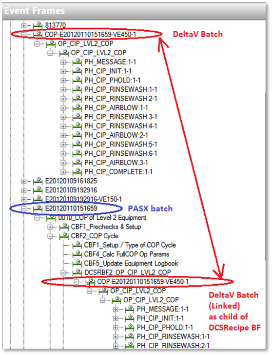

# How batch interfaces process event data

<!-- Customized for ABB 800xA. -->

The interface processes start and end events for each level. The level at which a recipe executes depends on the equipment it requires. For example, a batch-level recipe is most likely composed of unit procedures and procedures executed on multiple different units. By contrast, an operation-level recipe might execute a set of phases in a single unit. The interface automatically creates PIBatches (or level 1 events) and PIUnitBatches (or level 2 events) for operation- and lower-level recipes, even though the events in the data source do not include these levels. The BES events that trigger the start and end of each level are vendor-specific. For details, refer to the vendor-specific information in this document.

When you configure the interface to generate event frames in PI AF, the interface creates a set of event frame templates in the target database, one template for each level in the standard S88 batch hierarchy. You can modify the templates to customize the data that is stored in the generated event frames. The interface creates equipment assets in the Module Database or PI AF (depending on where you're storing batch data) based on allocation events from the BES, and populates the attributes of those assets with relevant data.
    
**Caution**: To ensure compatibility with RtReports, any custom Event Frame batch template used must be derived from a default Batch Interface Event Frame Template.

<!-- Mark Bishop 6/11/21: Added content and subheadings below -->

To compose the history that it stores in the PI System. the interface uses the timestamps from the data source, not the system time on the interface node. When updating health tags, the interface uses the system time on the interface node.
    
**Note:** By default, when processing the incoming Batch ID, Name, Product, Recipe and Procedure fields, the interface replaces the following reserved characters with an underscore: * ' ? ` ". To override these replacement characters, use PI System Management Tools **Operation > AF Link** option to configure the desired replacement characters.

## PIBatch/Procedure
    
The PIBatch is the highest level recorded as an event frame. Its properties record general data such as the batch ID, recipe name and type, and so on. If a recipe is composed solely of levels below the unit batch (for example, an operation- or phase-level recipe), the interface generates parent batches and unit batches. The best way for the interface to determine the precise start and end time for a unit batch is to use equipment arbitration events, which record the time a unit was acquired or released. If the BES does not support arbitration events, the interface uses unit batch start and end events, which can be affected by the start and end of lower levels and are inherently less precise than equipment acquisition events. 

## PIUnitBatch/Unit Procedure
    
For each unit procedure that it reads from the data source, the interface creates an event frame equivalent to a PIUnitBatch. The start and end times record the duration of physical processing within a unit. The event frame properties contain the batch ID and procedure name as recorded by the data source unless you override it by configuring a batch ID mask using PI Event Frames Interface Manager (on the **Batch Setup** tab). When operation- or phase-level recipes are run, the interface creates a parent unit batch, using the operation or phase name as the procedure name. 

## Operation/PISubBatch

For each operation that it reads from the data source, the interface creates an event frame equivalent to a PISubBatch as a child of the parent PIUnitBatch object. For recipes that occur below the unit batch level, the interface generates parent data. 

## Phase/PISubBatch

For each phase that it reads from the data source, the interface creates an event frame equivalent to a PISubBatch as a child of the parent operation-level object. For recipes that occur below the unit batch level, the interface generates parent events. 

## Phase State/PISubBatch

For each phase state that it reads from the data source, the interface creates an event frame equivalent to a PISubBatch as a child of the parent phase-level object. The start of a new phase state ends the previous phase state, except for the terminating COMPLETE, ABORTED and STOPPED phase states. 

## Phase Step/PISubBatch

Phase steps are not S88-compliant and are implemented differently by BES vendors (some vendors do not support them). By default, phase steps are not enabled. To enable phase steps using PI Event Frames Interface Manager, go to the **Batch Setup** tab, select the **Report as step** check box, and specify the strings recorded by the BES to indicate the start and end of a phase step. 
    
For each phase step that it reads from the data source, the interface creates an event frame equivalent to a PISubBatch as a child of the parent phase-state-level object. Phase steps are always created beneath the first RUNNING phase state, regardless of whether the parent phase state has ended. The first start event starts a phase step, and subsequent start events for the same phase step are ignored. Likewise, the first end event ends a phase step, and subsequent end events for the same phase step are ignored. 

If the parent phase is not found, phase steps do not create higher-level procedures, unit procedures, phase states or operations. If the phase step is not closed by an appropriate closing event, it is closed by the end of the parent phase. Zero-duration phase steps are ignored. 

## Linking BES to MES Batches Using Event Frames

To consolidate the output of a manufacturing execution system and a batch execution system, specify the linking element as follows: using PI Event Frames Interface Manager, go to the **Batch Setup** tab. For MES interfaces, enable the **Link to child event frames** option, and specify the path to the AF element. For BES interfaces, enable the **Link from parent event frames** option, and specify the path to the same AF element. 

This configuration is typical in an environment where a manufacturing execution system supervises multiple batch execution systems to manufacture a single product. For each batch execution system, configure a dedicated interface instance and specify the same PI AF linking element. When an event frame created by the manufacturing execution system interface references the creation of a batch in the batch execution system, a reference is made to the manufacturing execution system event frame in the linking element. Then, when the batch execution system interface creates its event frame, a reference to it is created in the manufacturing execution system event frame, creating a consolidated view of all the related events from different systems. 

For example, the following figure illustrates an event frame created based on a batch from an Emerson DeltaV batch execution system. This event frame is referenced in an event frame created by a Werum PAS-X manufacturing execution system. Other batch interface instances that are configured to use the same linking element create references to their batches under the same link. 

Unlike other OSIsoft interfaces, batch-related interfaces do not use PI buffering. Batch data is persistent in the data source and not in danger of being lost. If the interface loses its connection to the PI Data server, it continues to collect data from the data source, transmitting it to the server when the connection is reestablished.
