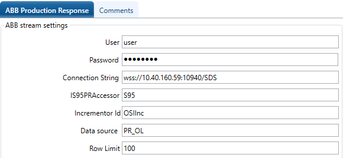

# Data sources

<!-- Customized for ABB 800xA -->

To enable the interface to access the server where ABB 800xA stores local data store batch data, you must install PI Interface for ABB 800xA Production Response Batch on the interface node prior to starting the interface. Be sure to install the version that corresponds to the version of local data store that you are running.

For each data source, you must configure the Net Service Name, ABB Ability, username, and password required to connect. You configure these settings using PI Event Frame Interface Manager (go to the <xref:BIF_SourceTab>).

The interface reads batch event data from the following streams in the data source:

